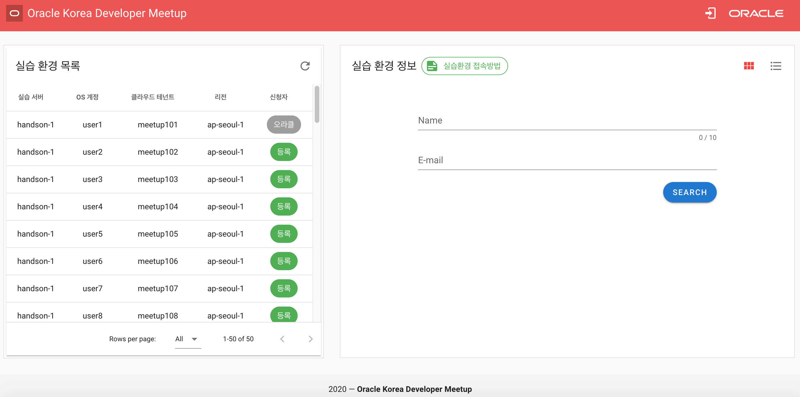
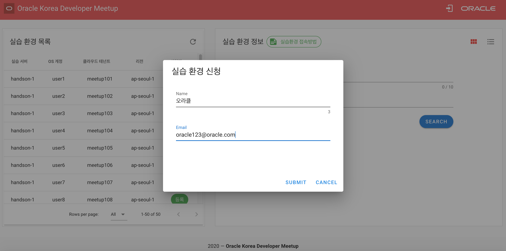
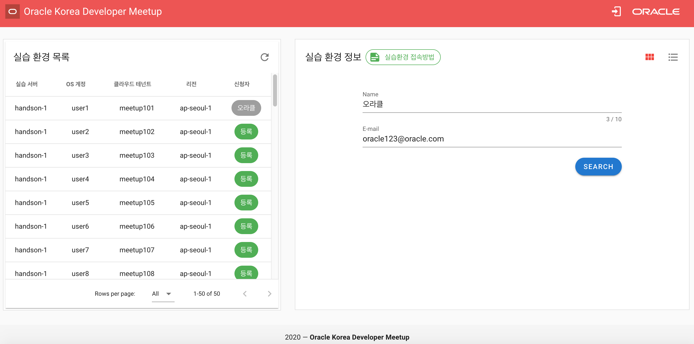
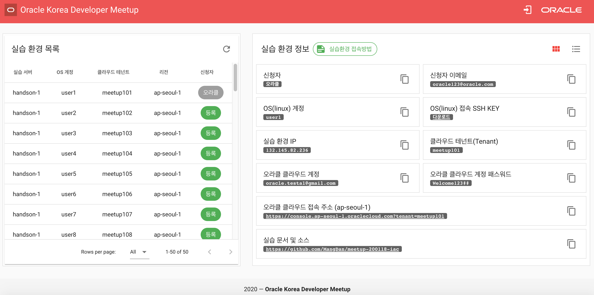
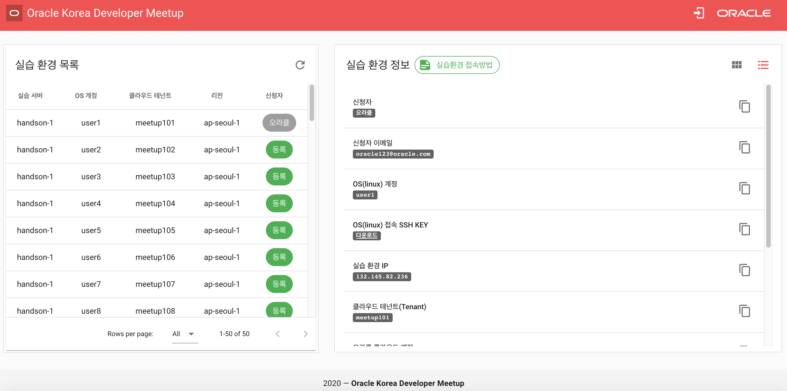
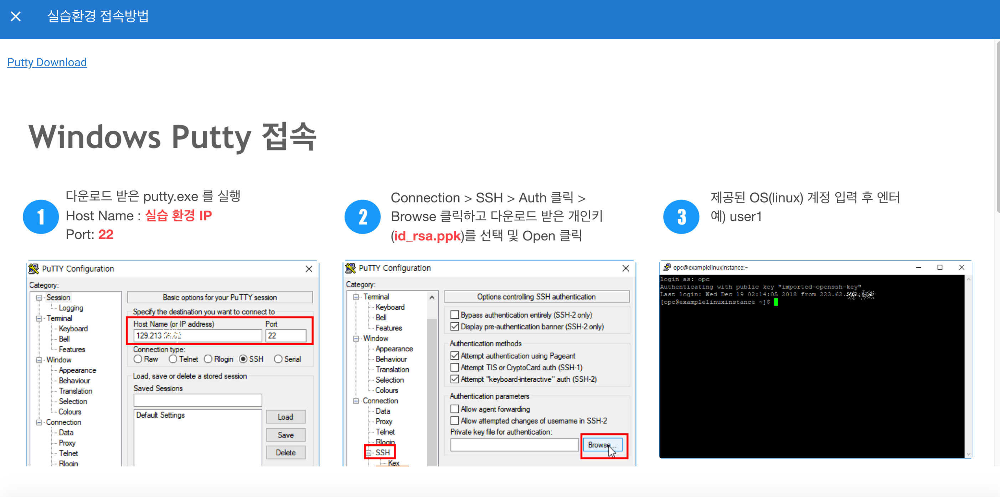
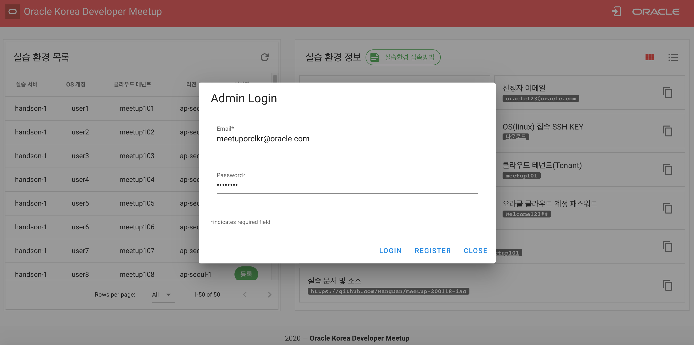
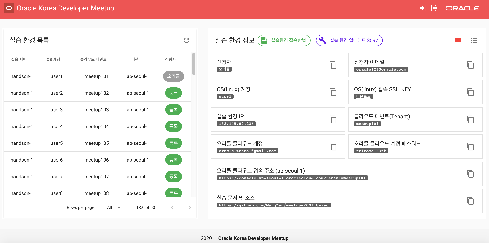
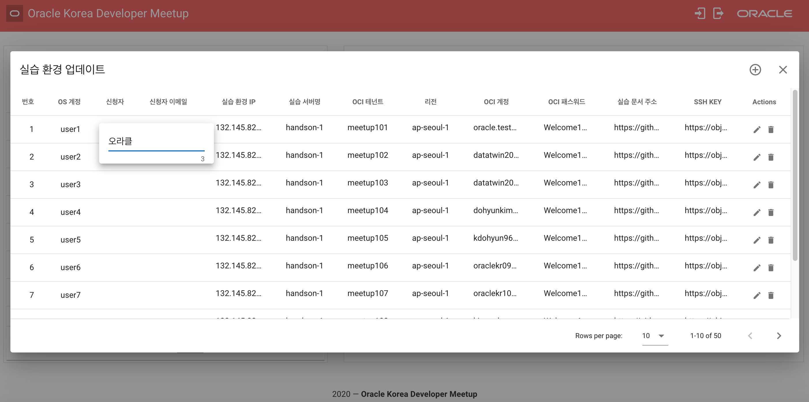
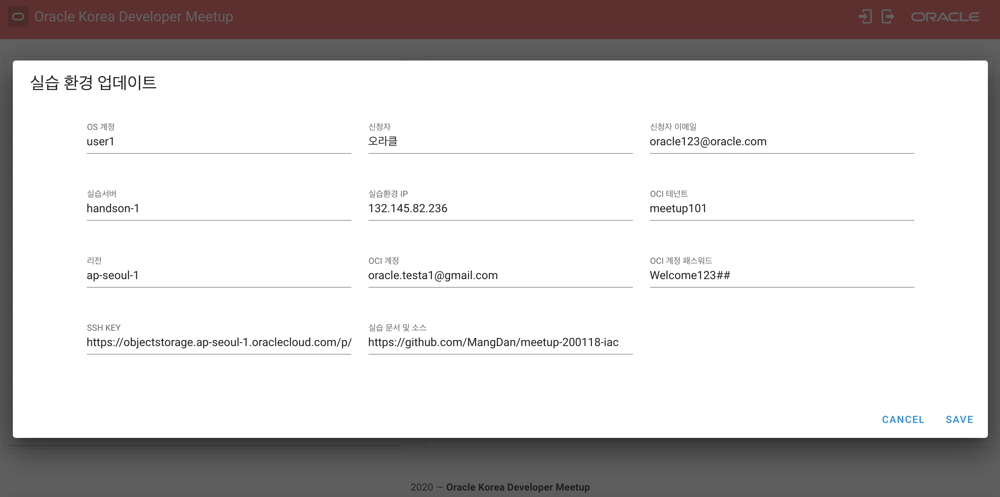

# Oracle Korea Meetup HandsOn Environments
Provide a hands-on environment for attendants.

---

## This application built using.
* Vuejs + Vuetify + Vuex for frontend
* JWT (JJWT Library) for authentication
* Spring Boot + JPA for business logic
* Oracle Database for data store

## Screenshots
홈

실습 환경 신청

신청한 실습 환경 조회

신청한 실습 환경 조회 결과 (카드 타입)

신청한 실습 환경 조회 결과 (리스트 타입)

접속 가이드

관리자 로그인 / 관리자 계정 생성

실습 환경 업데이트 버튼 활성화

실습 환경 업데이트 (컬럼 단위)

실습 환경 업데이트 (로우 단위)
